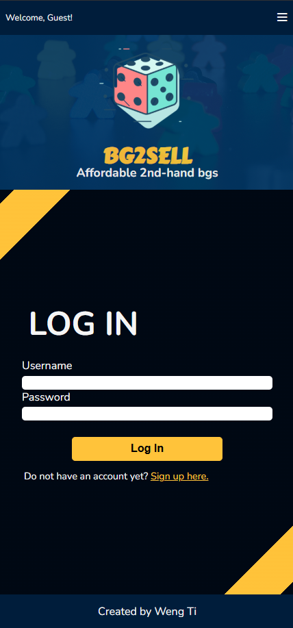
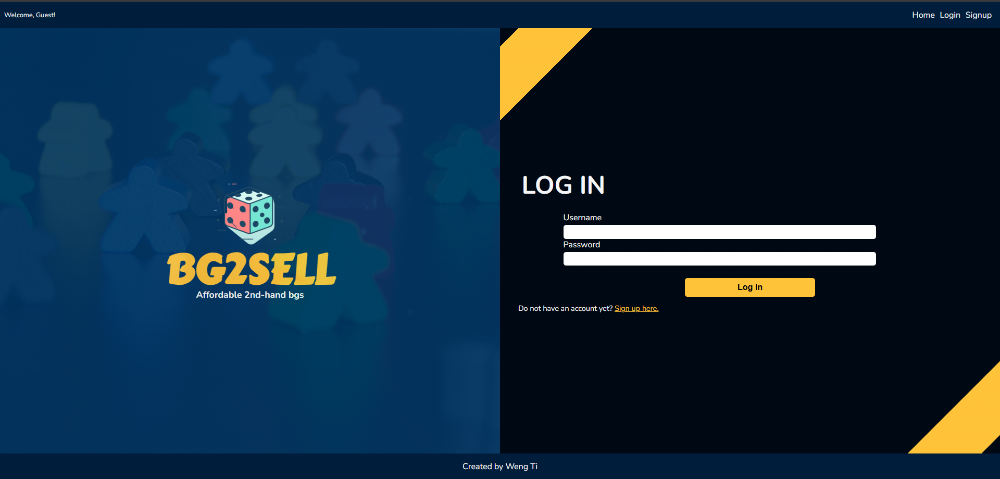
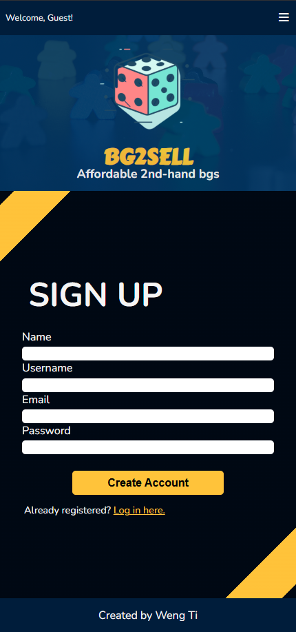
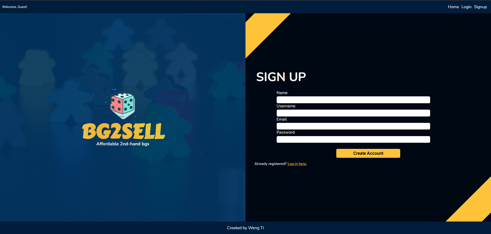
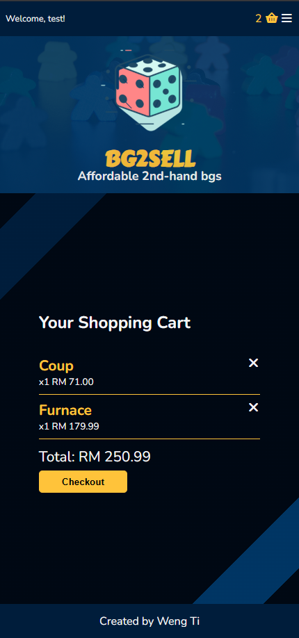
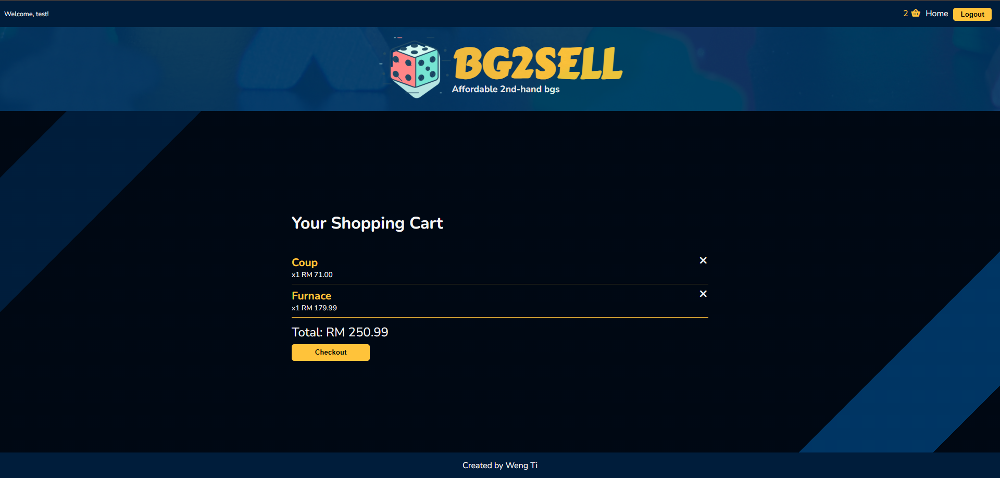
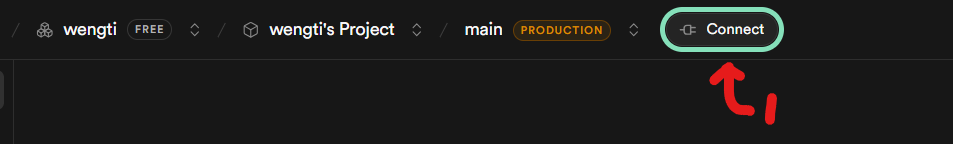
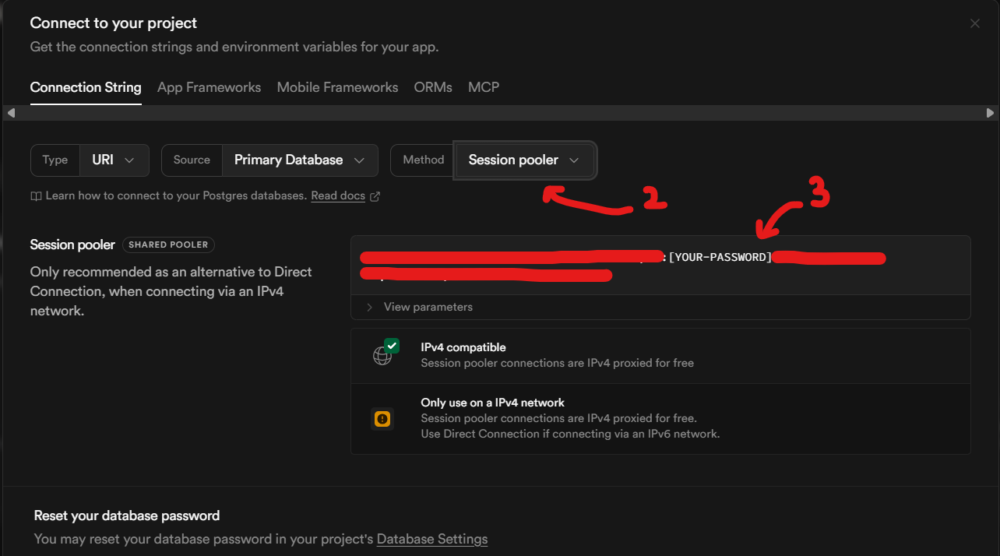

# BG2SELL 
A mock-up e-commerce site that sells 2nd hand board game with a backend (***Express.js***), database (***Supabase***) and payment gateway (***Stripe***).

## Get started

* Visit the website here: [BG2SELL](https://bg2sell.onrender.com/)
* A demonstration video: [Demo Video](https://www.youtube.com/watch?v=I5TpeobEpMc)

<div align='center'>
    
    
</div>

<div align='center'>
    
    
</div>

<div align='center'>
    
    
</div>

<div align='center'>
    
    
</div>

## Key takeaways  for ***Express.js***

1. `app.use(express.json())`
    * Important to parse request body into JS object format.

2. Use Router for a cleaner code
    ```js
    // In server.js
    app.use('/api', apiRouter)

    // In apiRouter.js
    export const apiRouter = express.Router()
    apiRouter.get('/', getItems)
    apiRouter.get('/genre', getGenre)

    // In controllers.js
    export async functon getItems(){
        // What this route is supposed to do
    }
    ```

3. Make use of middleware to prevent unauthenticated access.
    ```js
    export function checkAuth(req, res, next){

        if(!req.session.userId){
            const name = 'Access Denial.'
            const message = 'The user is not logged in.'
            return res.status(400).json({name,message})
        } else {
            next()
        }
    }
    ```

4. Sanitization and authentication of user's login-data
    * Check if all fields are provided.
    * Trim white spaces using `.trim()`
    * Make use of regex to `.test()` if input contains invalid format.
    * Use `validator` ([package](https://www.npmjs.com/package/validator)) to validate input format (i.e. email) OR whether a password is strong enough.
    * Check if username / email has been registered before
    * Use `bcryptjs` ([package](https://www.npmjs.com/package/bcryptjs)) to hash and authenticate user's password.

5. Use of status code
    * `200` - ok
    * `201` - Resource posted
    * `204` - Resource deleted, when used must return nothing using `res.status(204).send()`
    * `400` - Bad request.
    * `401` - Bad credentials.
    * `404` - Not Found.
    * `500` - Server side error

6. Always try, catch and return in backend's controller
    ```js
    try{

        //Your controller's main code
        return res.json({...})
    }
    catch(err){
        console.log(err)
        const message = 'An error message'
        return res.status(500).json({message})
    }
    ```

7. Ideas behind express-session and cookies

    * Idea behind cookies:
        - Cookie is a piece of string that is sent from the client to the backend.
        - The backend will look up for session that matches the provided string.
        - If the matching session exists, the information attached to the session will be returned to the user.
        - Useful for session-persistence and user-authentication.
        - For a better explanation: [link](https://www.youtube.com/watch?v=GtvlSzrHhOc)

    * The package for `express-session` ([package](https://www.npmjs.com/package/express-session))
    * Other package required: `connect-pg-simple` ([package](https://www.npmjs.com/package/connect-pg-simple))

    * The setup:
        ```js
        import session from 'express-session';
        import connectPgSimple from 'connect-pg-simple';
        import { getTableConnection } from '../table/getTableConnection.js';

        const PgSession = connectPgSimple(session)

        const sessionMiddleware = session({
        store: new PgSession({                                   
            pool: getTableConnection(),
            tableName: 'user_sessions',
            createTableIfMissing: true, // Auto-create table
        }),
        secret: process.env.SESSION_SECRET,
        resave: false,
        saveUninitialized: false,
        cookie: {
            secure: process.env.NODE_ENV === 'production',
            httpOnly: true,
            sameSite: 'lax'
        }
        })

        if (process.env.NODE_ENV === 'production') {
        app.set('trust proxy', 1);
        }
        app.use(sessionMiddleware)
        ```
    
    * Code Explanation:
        - Locally when creating a session, the `store` parameter may be ignored. 
            * However, it is not a good practice for deployment. 
            * This is because the session store will not be stored in memory only and erased everytime server restart.
            * Furthermore, for a multi-server environment, this is not applicable as all server ideally should have only 1 session store.
            * With the help of `connect-pg-simple`, a table is created in the SUPABASE database as the unified session store to solve above mentioned issues.
        - `secret` can be set to any values but is important to prevent impostor from accessing other's sessions.
        - `resave` and `saveUnitialized` are set to false so the session store does not store a client's cookie if the session is never modified.
            * With this setting, only when the session is modified (i.e. `req.session.userId = 1`) then the cookie will be saved into the session table in the database.
        - `cookie.secure`
            * The following is a snippet from the package repository.
                > Note be careful when setting this to true, as compliant clients will not send the cookie back to the server in the future if the browser does not have an HTTPS connection.
        - `cookie.httpOnly`
            * The following is a snippet from the package repository.
                > Note be careful when setting this to true, as compliant clients will not allow client-side JavaScript to see the cookie in document.cookie.
        - `cookie.sameSite`
            * `strict` - Cookie is only sent for request from the same site that sets it.
            * `lax` - Cookie is sent with "safe" cross-site requests (top-level navigation using GET), but not with embedded requests.
            * `none` - Cookie is sent with ALL requests, including cross-site.
        
        - `app.set('trust proxy', 1);` is necsesary in production (i.e. using Render)
            * This is because such deployment method means that the Express app doesn't receive requests directly from users, instead it receives them from the proxy (Render).
            * Without trusting this proxy, the connection is deemed not secure and can break the cookie settings.


    * ***IMPORTANT!*** 
        * The backend only stores part of the cookie string.
        * The user have the full cookie string.
        * Therefore, the owner of this site cannot simply access any user's session unless he has the full cookie string from the user.


## Key takeaways for ***Supabase***
1. Host the database on a backend platform instead of using memory such as PG-lite.
    ```js
    import { Pool } from 'pg'
    export function getTableConnection() {
        const connectionString = process.env.SUPABASE_CONNECTION_STRING
        return new Pool({
            connectionString,
            ssl: process.env.NODE_ENV === 'production'
                ? { rejectUnauthorized: false }
                : false
        })
    }
    ```
    * Package required: `node-postgres` ([package](https://node-postgres.com/))
    * How to get SUPABASE_CONNECTION_STRING?
        - Remember to replace the password that can be set in the supabase dashboard.
        <div align='center'>
            
            
        </div>
    
    * With this setup, the following can be performed with typical PostgreSQL syntax
        - IMPORTANT: always remember to close the db
        ```js
        const ret = await db.query(`SELECT * FROM items WHERE id = $1`, [userId])
        console.log(ret.rows) // The result is stored in the rows array
        await db.close()
        ```

2. How to search for text that have accents such as á, à, â, ä, ã...
    - When creating the table
        ```js
        await db.query(`
        CREATE EXTENSION IF NOT EXISTS unaccent
        `)

        const ret = await db.query(`
        SELECT * FROM items
            WHERE (unaccent(title) ILIKE '%${search}%' OR
                    unaccent(designer) ILIKE '%${search}%') AND
                    quantity > 0
            ORDER BY title
        `)
        ```

## Key takeaways for ***Stripe Payment Gateway***
- Credit to [Video](https://www.youtube.com/watch?v=1r-F3FIONl8&t=352s) and [Repo](https://github.com/WebDevSimplified/stripe-checkout-simple/blob/main/server/server.js)
- For full Stripe documentation: [documentation](https://docs.stripe.com/api)

1. `stripe.checkout.sessions.create`
    - Used to create a payment session
    - The returned object has a property of `url` that links to the Stripe payment user-interface
    - Once completed or failed, it redirects the user back to the `success_url` or `cancel_url` respectively.

2. Remember to enable `cors()` ([package](https://www.npmjs.com/package/cors))
    ```js
    app.use(
        cors({
            origin: "http://localhost:5500",
        })
    )
    ```

3. Since this is a sandbox environment, use the following card information to test the transaction: [link](https://docs.stripe.com/testing)